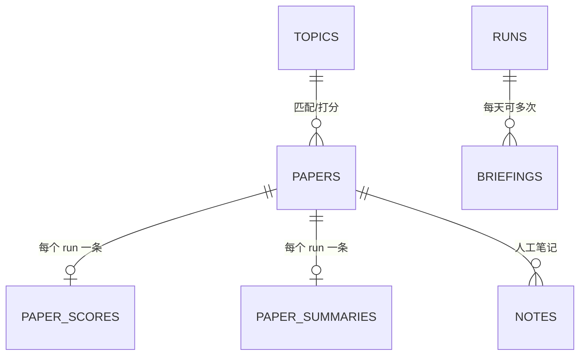

# PaperPilot — arXiv 每日文献情报系统 · 设计文档

> 版本：v1.0 · 状态：设计评审稿
> 上位文档：**[`PRINCIPLES.md`](PRINCIPLES.md)（宪法 / 基调）→ [`SPEC.md`](SPEC.md)（要实现什么）** —— 本文是它们的技术实现展开；冲突时以 `PRINCIPLES.md` 为准。
> 定位：基于 arXiv 的**每日论文抓取 → AI 智能筛选 → AI 结构化总结 → 每日简报（本地 Web）**的个人文献调研工具。

---

## 1. 产品定位

| 维度 | 说明 |
| --- | --- |
| 一句话 | 给科研人员的「arXiv 每日情报员」：每天早上自动把关注领域的新论文筛完、读完、写成简报 |
| 核心闭环 | 抓取 → 筛选 → 总结 → 简报 → 调研检索 |
| 差异化 | 不是简单的 RSS 阅读器；用 AI 做**相关性把关 + 结构化精读**，每天只推 5–15 篇真正值得看的 |
| 非目标 | 不接 AI 框架实现、不做多人协作、不做分布式、不抓取全站（只抓关注领域） |

### 1.1 用户场景

1. **每日资讯**（主场景）：早上打开 `http://127.0.0.1:8080/`，看今日简报：Top 推荐（TL;DR + 推荐理由 + 相关性评分）、分类速览、可一键跳原文/PDF。
2. **文献调研**（次场景）：在检索页按关键词/分类/评分过滤，翻阅历史积累的论文库，收藏、加笔记、导出 BibTeX。
3. **兴趣管理**（2026-09-30 转向）：维护**画像池**——主题是「往池子里注入的词条包」
   （关键词/分类/排除词/关注作者 + 注入权重），行为信号持续往同一池子加权重；
   **日报线与推荐流都吃这个池子**，不再有"每主题配额/阈值"。
4. **手动触发**：Web 上一键补跑某天，或 CLI 执行 `paperpilot run daily`。

---

## 2. 总体架构

```mermaid
flowchart TB
    subgraph L1["表现层 · Web UI（本地 127.0.0.1）"]
        UI1[今日简报 /digest/today]
        UI2[论文库 /papers]
        UI3[论文详情 /papers/{id}]
        UI4[设置 /settings]
    end

    subgraph L2["应用层 · Service 编排"]
        S1[DailyPipelineService]
        S2[RetrievalService]
        S3[ProfileService]
        S4[CLI 入口]
    end

    subgraph L3["领域层 · Domain（纯业务，无 IO）"]
        D1[Paper / PaperSummary / Briefing]
        D2[RelevancePolicy 阈值与配额]
        D3[AI Ports: LLMPort / RankerPort / SummarizerPort]
    end

    subgraph L4["基础设施层 · Infra"]
        I1[ArxivFetcher]
        I2[(SQLite + FTS5)]
        I3[AIMockService]
        I4[BriefRenderer / Notifier]
    end

    L1 --> L2 --> L3 --> L4
    I3 -.->|未来替换| AIU[统一 AI 框架 Adapter]
```

**依赖方向单向向内**：Infra 实现 Domain 定义的 Port；Domain 不认识 arXiv、SQLite、HTTP。

### 2.1 每日数据流

```
arXiv API ──► ArxivFetcher ──► PaperNormalizer ──► SQLite(papers, status=new)
                                                          │
   ┌────────────────────────── DailyPipelineService ◄──────┘
   │ 1. 取候选：status=new 且匹配主题分类/关键词
   │ 2. RuleGate：硬规则过滤（排除词、语言、分类、作者黑名单）→ status=scored-pending
   │ 3. RankerPort.score_batch：AI 相关性 0~1 + 理由 + 标签 → paper_scores
   │ 4. 每主题按 (评分, 新鲜度) 取 TopK 配额（默认 8 篇 + 关注作者直通）
   │ 5. SummarizerPort.summarize：结构化精读 → paper_summaries
   │ 6. Renderer 组装 briefing（Markdown）→ briefings + status=in-briefing
   │ 7. 可选通知（webhook / 邮件）
   ▼
/digest/YYYY-MM-DD  ← 全部可追溯、可重跑（幂等靠 run_id + date）
```

**关键不变量**

- 每个阶段落库前先校验（pydantic），AI 输出解析失败 → 降级（抽取式摘要兜底）+ 记录 `ai_calls.error`。
- 全流程幂等：同一天重跑不会重复生成 paper/summary/briefing（`arxiv_id`、`(run_id, paper_id)`、`(date)` 唯一约束）。
- AI 是「奢侈品」不是「必需品」：AI 挂掉时简报降级为「规则筛选 + 原文摘要摘编」，页面标注 `ai=false`。

---

## 3. 模块职责

| 模块 | 职责 | 输入 → 输出 |
| --- | --- | --- |
| `infra.arxiv.ArxivFetcher` | 按主题检索 arXiv API，增量抓取，限速与重试 | (主题, 日期窗) → `RawPaper` |
| `infra.arxiv.Normalizer` | Atom XML → `Paper` 实体，字段清洗/补全 | Atom entry → `Paper` |
| `domain.policy.RuleGate` | **全局**硬规则过滤：语言、作者黑名单（分类/排除词已改走画像软权重，见 §兴趣池） | `[Paper]` → `[Paper]` |
| `domain.policy.SelectionPolicy` | 阈值、**总量配额**、连坐降权（同一作者一天最多 N 篇） | `[Score]` → `[SelectedPaper]` |
| `domain.service.DailyPipelineService` | 编排上面所有步骤，产出 Briefing | 任务参数 → `Briefing` |
| `domain.ports.ai.*` | AI 能力契约（本项目的**集成边界**） | 见 §5 |
| `infra.ai.AIMockService` | 本地确定性假实现，供联调/测试/降级 | 同 Port 签名 |
| `infra.repo.*` | SQLite 读写，FTS5 索引维护 | 实体 ↔ 行 |
| `infra.render.BriefRenderer` | Briefing → Markdown/HTML | `Briefing` → str |
| `infra.notify.Notifier` | Webhook/邮件推送（默认关闭） | `Briefing` → 发送结果 |
| `app.web` | FastAPI 路由 + Jinja2 模板 + HTMX | HTTP ↔ Service |

---

## 4. AI 接入抽象层（本项目最关键的边界）

> 统一 AI 框架在别处开发。本项目的策略：**只依赖最小契约 `LLMPort`**，上层能力（相关性排序、总结、问答）都用 `LLMPort` 组合实现。框架就绪时只需提供 1 个类，DI 里换掉绑定。

### 4.1 分层契约

```
统一 AI 框架（外部）
      │  实现
      ▼
┌─────────────────────────────────────────────┐
│ LLMPort            ← 唯一必须实现的契约      │
│   complete(messages, temperature, json_mode)│
│       → LLMResult(text, tokens, latency)    │
├─────────────────────────────────────────────┤
│ RankerPort         ← 默认实现跑在 LLMPort 上 │
│ SummarizerPort     ← 默认实现跑在 LLMPort 上 │
│ QAPort(预留)       ← 文献问答，二期          │
└─────────────────────────────────────────────┘
```

设计为「一个大口 + 三个小口」的原因：上层能力随产品迭代频繁变化，而底层 `complete()` 签名极稳定，把框架依赖压缩到最小面。

### 4.2 契约代码草图（冻结条款）

```python
# src/paperpilot/domain/ports/ai.py
from __future__ import annotations
from typing import Literal, Protocol, Sequence
from pydantic import BaseModel, Field

# ---------- 底层契约：外部框架唯一必须实现的东西 ----------
class Message(BaseModel):
    role: Literal["system", "user", "assistant"]
    content: str

class LLMResult(BaseModel):
    text: str
    model: str
    prompt_tokens: int = 0
    completion_tokens: int = 0
    latency_ms: int = 0

class LLMPort(Protocol):
    """统一 AI 框架适配器必须满足的最小接口。"""
    def complete(
        self,
        *,
        messages: Sequence[Message],
        temperature: float = 0.2,
        max_tokens: int = 2048,
        json_mode: bool = False,   # True 时框架须保证返回可 json.loads 的文本
    ) -> LLMResult:
        ...

# ---------- 上层能力：默认实现组合自 LLMPort ----------
class RelevanceScore(BaseModel):
    score: float = Field(ge=0.0, le=1.0)
    label: Literal["must_read", "worth", "skip"]
    reason: str                                  # 给用户看的中文一句话理由
    tags: list[str] = []                         # 如 ["RAG", "长文本"]

class PaperSummary(BaseModel):
    tldr: str = Field(max_length=120)            # 一句话结论
    problem: str                                 # 解决什么问题
    method: str                                  # 怎么做的
    results: str                                 # 关键结果/数字
    novelty: str = ""                            # 主要贡献点
    keywords: list[str] = []

class RankerPort(Protocol):
    def score_batch(
        self, *, papers: Sequence[Paper], profile: InterestProfile, run_id: str
    ) -> list[RelevanceScore]: ...               # 长度必须与 papers 相同，失败项抛/标记降级

class SummarizerPort(Protocol):
    def summarize(
        self, *, paper: Paper, profile: InterestProfile, run_id: str
    ) -> PaperSummary: ...
```

### 4.3 对统一 AI 框架的最低要求（交给对接方的验收清单）

1. 提供 `LLMPort` 的实现类（异步优先，允许同步适配），可并发、可限流、可重试。
2. `json_mode=True` 时返回合法 JSON；本项目会用 pydantic 二次校验，**解析失败必须抛错而不是返回垃圾**。
3. 支持 system/user 消息与 temperature 参数；提供 token 用量与耗时（用于 `ai_calls` 记账与本地产能/成本观测）。
4. 模型可配置（`settings.ai.model`），允许本地小模型与云端模型混用。
5. 明确的错误分类（限流/超时/上下文超长/服务不可用），本项目分别走「退避重试 / 降级 / 跳过」三种策略。

### 4.4 本地 Mock 与降级链

| 等级 | 实现 | 用途 |
| --- | --- | --- |
| A | `UnifiedAIAdapter`（未来） | 真实能力 |
| B | `LLMHeuristicService` | 基于 TF-IDF 关键词重合度的「伪相关性」+ 抽取式摘要（首句+含数字句），链路可跑通、可测试 |
| C | 完全无 AI | 简报只放原 Abstract 摘编，标注 `ai=false` |

配置项 `ai.provider: auto|unified|heuristic|off`，默认 `auto`（unified 未注册就落 heuristic）。**任何等级下业务流程都必须走完**，这是本项目不等 AI 框架的关键。

---

## 5. 采集模块设计（arXiv）

### 5.1 采集策略

- **主通道：arXiv 官方 API**（`export.arxiv.org/api/query`），Atom 格式，遵守 1 req / 3s 限速，自定义 User-Agent 标明用途。
- **增量方式（二选一，可配）**：
  - 按分类增量：`search_query=cat:cs.CL+OR+cat:cs.AI+OR+cat:cs.LG`，`sortBy=submittedDate&sortOrder=descending`，配合 `lastUpdatedDate:[T0 TO T1]` 时间窗；
  - 按主题检索：每个主题转成关键词 query（`all:"mixture of experts"`）单独拉取后合并。
- **备用通道**：arXiv RSS（`export.arxiv.org/rss/{category}`）作为巡检兜底，与 API 结果按 `arxiv_id` 去重合并。
- **PDF 不预下载**：详情页点「下载」时才抓并入库缓存，避免触发限速与版权风险。

### 5.2 字段映射（Atom → Paper）

| arXiv 字段 | Paper 字段 | 处理 |
| --- | --- | --- |
| `id` (`.../abs/2501.01234v2`) | `arxiv_id`（去版本号）、`version` | 主键取 base id，版本变更走 update |
| `title` | `title` | 折叠换行/多空格 |
| `summary` | `abstract` | 原样保留，总结的输入 |
| `author/name` | `authors: list[str]` | |
| `category[]` | `categories`, `primary_category` | 主题匹配依据 |
| `published` / `updated` | `published_at` / `updated_at` | 时区归一 UTC |
| `link[@title='pdf']` | `pdf_url` | 只存 URL，按需下载 |

### 5.3 健壮性

- HTTP 429/5xx/超时：指数退避重试 3 次，仍失败则该主题记 `fetch_errors`，**不影响其他主题**；
- 解析单条失败：跳过该 entry 并记 warning，批次不中断；
- 断点续抓：`runs` 表记录 cursor（每个主题的 `start` 偏移/时间窗），`fetch` 崩溃后重跑不会从头开始；
- 幂等 upsert：`arxiv_id` 唯一键，重复抓取只更新 `updated_at`；
- 缓存：API 原始响应缓存 24h，重跑当天任务不重复请求 arXiv。

---

## 6. 筛选与流水线编排

```
候选(new) → RuleGate → 过规则(scored-pending) → AI 打分 → 阈值+配额 → 精选 → AI 精读 → 简报
                ↓丢弃                           ↓skip                 ↓放弃
            status=rejected                status=skipped       status=filtered-out
```

### 6.1 RuleGate（硬规则，零成本先砍一刀）

- 分类必须命中任一主题的 `categories`（未配则不限）；
- 命中任一 `exclude_keywords`（如 "survey of surveys"）→ 拒；
- 标题/摘要语言非英文 → 拒（可选）；
- 作者在 `blocked_authors` → 拒；
- 已在库且历史被人工标记 `skip` 的作者 → 降权（连坐策略）。

### 6.2 打分与配额

- `RankerPort.score_batch` 输入 = 单主题下的论文批 + 该主题画像，输出 `0~1 + label + 理由`；
- 入选规则：`score >= threshold(默认 0.6)`，每主题最多 `quota(默认 8)` 篇，全天简报总量上限 `max_papers(默认 15)`；
- 总分相同按 `published_at` 新的优先；`must_read` 直通不占配额（最多 3 篇/天）；
- 同作者一天最多 1 篇进简报（防刷屏），其余进「存档」；
- 被筛掉的论文仍完整入库（可检索、可翻案），只是不进简报。

### 6.3 成本与并发

- AI 只对过规则门的候选调用；单批 ≤ 10 篇一起打分（合并 prompt）；
- `ai_calls` 表记账（端口、用途、耗时、token、成败），按天汇总出「今日 AI 开销」；
- 并发度可配（`ai.max_concurrency`，默认 2），尊重限流。

---

## 7. 每日简报设计

### 7.1 内容结构（Markdown 同时作为 Web 页渲染源）

```markdown
# arXiv 每日简报 · 2026-08-15
> 今日新论文 412 篇 → 过规则 63 篇 → AI 精选 9 篇（最后一遍规则: threshold=0.60）

## 今日必读 (must_read)
### 1. [When Scaling Meets Reasoning] ...
- TL;DR：一句话
- 问题 / 方法 / 结论：...
- 推荐理由（AI）："与你关注的 test-time compute 直接相关，方法部分有新意"
- 相关性 0.92 · [原文](...) · [PDF](...) · 已读 ☐

## 值得一看 (worth)
（简版：TL;DR + 评分 + 链接）

## 分类速览
| 分类 | 篇数 | 精选 | 代表论文 |

## 存档（过规则未入选，可翻案）
...
```

### 7.2 展示与归档

- Web 路由 `/digest/{date}`，默认今天；右侧栏显示近 30 天简报入口；
- 简报一旦生成即**不可变**（同一天重跑生成新 `run`，旧 briefing 归档为 `superseded`，页面可对比）；
- 顶部统计条：抓取数 / 过规则数 / AI 调用次数与耗时 / 降级状态。

### 7.3 通知（可选，默认关）

`settings.notify.webhook_url` 配置飞书/钉钉/企业微信机器人，推送摘要前 3 条 + 链接。实现走 `Notifier` Port，未来可换邮箱/Telegram。

---

## 8. 文献调研与检索

| 能力 | 实现 | 优先级 |
| --- | --- | --- |
| 关键词全文检索 | SQLite FTS5（title/abstract/keywords/tldr） | M3 必做 |
| 组合过滤 | 分类 / 日期 / 最低分 / 必读标签 / 已读未读 | M3 |
| 收藏与笔记 | `notes` 表，详情页内嵌编辑 | M5 |
| 导出 | BibTeX / Markdown 引用 | M5 |
| 语义检索 | 向量检索（sqlite-vec 或 numpy 暴力余弦） | M5+（复用 mecha 的 embedding，避免自建模型） |

---

## 9. 数据模型（SQLite）



核心表（约束即防重）：

- `papers`：`arxiv_id` PK、title、abstract、authors JSON、categories JSON、primary_category、published_at、pdf_url、status（new/rejected/in_briefing/archived/read）、first_seen_at。
- `paper_scores`：PK `(run_id, paper_id)`、topic_id、score、label、reason、tags JSON、model。
- `paper_summaries`：PK `(run_id, paper_id)`、tldr、problem、method、results、novelty、keywords JSON、tokens、latency_ms、model。
- `briefings`：`date` + `run_id` PK、title、markdown、stats JSON、status（draft/superseded）、ai_enabled。
- `topics`：id、name、keywords JSON、exclude_keywords JSON、categories JSON、authors JSON、quota、threshold、enabled。
- `runs`：id、mode(daily/manual)、started_at、finished_at、cursor JSON、stats JSON、status、error。
- `ai_calls`：id、ts、port、purpose、model、latency_ms、tokens、ok、error。
- `notes`：id、paper_id FK、content、created_at、updated_at。
- `reading_state`：`paper_id` PK、read/marked_skip/star。

全文索引：`papers_fts`（FTS5 外部内容表，随 papers 触发器同步）。

---

## 10. Web 应用（本地）

技术形态：**FastAPI 服务端渲染 + Jinja2 + HTMX（CDN）+ 少量原生 JS**。理由：个人单机自用，零前端构建链、一个 `uvicorn` 进程跑全部。

| 路由 | 页面 | 说明 |
| --- | --- | --- |
| `/` | 今日简报（无则空态 + 引导按钮） | |
| `/digest/{date}` | 历史简报 | |
| `/papers` | 论文库列表 | 过滤栏 + 分页 + FTS 搜索框 |
| `/papers/{arxiv_id}` | 详情 | 原文摘要、AI 总结、评分理由、PDF 链接、笔记、已读/收藏开关 |
| `/settings` | 设置 | 主题 CRUD、阈值/配额、抓取时间、AI provider、通知 |
| `/settings/run` | 触发一次运行 | HTMX POST，进度条轮询 |
| `/healthz` | 健康检查 | 供 CLI 探测 |

运行方式：`paperpilot web` → `http://127.0.0.1:8080`；`paperpilot run daily` 跑当天流水线；`paperpilot fetch --days 3` 补抓。无常驻定时（2026-09-26 用户裁决删调度器）：想看日报就打开软件点「立即生成」或到 dsh 让 AI 跑——脉冲式，用完即走。

---

## 11. 项目结构

```
Get Paper/
├── README.md
├── docs/                     ← 文档：PRINCIPLES.md（宪法）→ SPEC.md（要实现什么）→ DESIGN.md（本文档）；GAPS.md
├── pyproject.toml            ← 依赖 (fastapi, uvicorn, sqlalchemy, jinja2, httpx, feedparser, pydantic, pyyaml, ruff, pytest)
├── config/
│   └── settings.yaml         ← 主题、阈值、AI provider、通知
├── src/paperpilot/
│   ├── __init__.py
│   ├── config.py             ← pydantic-settings 加载 yaml/env
│   ├── domain/               ← 纯业务，零 IO
│   │   ├── models.py         ← Paper/Score/Summary/Briefing/Topic (pydantic)
│   │   ├── ports/ai.py       ← LLMPort/RankerPort/SummarizerPort（契约）
│   │   ├── policy.py         ← RuleGate / ScoringPolicy / 配额
│   │   └── services.py       ← DailyPipelineService / RetrievalService
│   ├── infra/
│   │   ├── arxiv.py          ← Fetcher + Normalizer + 限速/重试/缓存
│   │   ├── ai/
│   │   │   ├── heuristic.py  ← Mock 实现（等级 B）
│   │   │   └── unified.py    ← 未来统一框架 Adapter（占位，标注 TODO）
│   │   ├── db.py / repo.py / fts.py
│   │   ├── render.py / notify.py
│   ├── app/
│   │   ├── container.py      ← DI 绑定：Port → 实现（按 settings.ai.provider）
│   │   ├── web.py            ← FastAPI 路由
│   │   ├── templates/ + static/
│   │   └── cli.py            ← typer/argparse CLI
│   └── main.py
├── tests/                    ← 单测 + 契约测试（Mock LLM 返回固定 JSON）
└── data/                     ← 运行时：sqlite、pdf 缓存、日志（gitignore）
```

---

## 12. 里程碑

| 阶段 | 内容 | 出口标准 | 预估 |
| --- | --- | --- | --- |
| **M1 骨架+采集** | 项目脚手架、DB schema、ArxivFetcher、`fetch` CLI | CLI 能把 3 个分类当天论文入库并去重 | 2–3 天 |
| **M2 流水线** | RuleGate、Heuristic AI、Pipeline、简报渲染 | `run daily` 全流程跑出当天 Markdown 简报（AI 为 Mock） | 3–4 天 |
| **M3 Web** | 路由/模板/详情页/设置页/手动触发 | 浏览器可看简报、搜论文、改主题并触发运行 | 3–4 天 |
| **M4 DSH 集成** | MCP 语义通道 + DSH 插件（自愈桥/工具注册/面板）+ launcher + 分段驱动流水线 | `paperpilot ai` 一条命令起全栈；真 MCP 协议活体测试通过 | 已完成 |
| **M5 打磨** | FTS 检索、笔记/收藏、BibTeX、通知、备份、重试加固 | 连续 7 天无人值守运行无人工干预 | 3–4 天 |

M1–M3 不依赖 AI 框架，可先行交付；M4 原计划「接统一框架 Adapter」，经调研（§17.0）改为
复刻其 DSH/MCP 架构——AI 对话与管理复用 DSH，PaperPilot 侧交付 MCP server + 插件 + launcher，
与外部框架的耦合面从「一个 Adapter」变为「一个已验证的集成模式」。

---

## 13. 风险与对策

| 风险 | 影响 | 对策 |
| --- | --- | --- |
| 统一 AI 框架延期/接口变动 | 智能筛选/总结不可用 | Port 抽象 + Mock 先行；契约只依赖 `complete()` 一个签名；契约测试固定化 |
| arXiv 限速/封 IP | 抓不全 | 3s 间隔 + 退避 + 缓存 + RSS 兜底；只抓关注领域，请求量小 |
| AI 幻觉进入简报 | 误导 | 结构化 schema 强校验；总结只允许基于给定 abstract（prompt 约束「不得使用外部知识」）；详情页始终并排展示原文摘要 |
| AI 成本失控 | 费用/限流 | 配额阈值、批量打分、`ai_calls` 记账、单日总量上限 |
| 简报里全是「不相关但分高」 | 可用性差 | 阈值可调 + 「存档可翻案」+ 人工 `marked_skip` 反哺规则 |
| 数据丢失 | 积累归零 | `data/` 每日自动打包备份到仓外的 `backups/` 目录（落在本机之外的另一个位置，天然异地） |
| 单机进程崩溃中断流水线 | 当天无简报 | 每阶段落库，重跑断点续；CLI 兜底触发 |

---

## 14. 后续扩展（本期不做，架构预留）

- **多源**：新增 `Fetcher` 实现（HuggingFace Papers、Semantic Scholar、AlphaXiv、Twitter/X 学术圈）统一进 `papers` 表，`source` 字段区分。
- **趋势分析**：基于积累数据做「关键词热度周报」「同名方法追踪」。
- **AI 问答**：`QAPort` 二期落地「与论文库对话」。
- **语义检索**：复用统一 AI 框架的 embedding，避免自建模型。

---

*评审通过后即可进入 M1 编码阶段；如需，我可以按 §11 结构直接生成项目骨架（pyproject + config + 各模块占位 + Mock AI + CLI），保证契约先行、可立即联调。*

---

## 17. 实现现状（M1–M4 + 脊椎层已交付，2026-09-21）

代码已按本文档落地并全部验证通过：**Python 71 个测试全绿、ruff 零告警；
DSH 插件 14/14 单测 + tsc 零错误 + bundle 产物可独立加载；MCP 活体测试（真 HTTP + 真 MCP
协议）跑通 AI 三段协作全流程**。

### 17.0 AI 框架调研结论（M4 立项依据）

对外部「统一 AI 接入框架」（Energy Level 项目）的调研结论：**该框架不提供"程序主动调 LLM"
的客户端**。它的形态是 **`src/mecha`（MCP 服务端）+ `dsh/`（Cordis 插件）+ launcher** 三段式：
app 把语义面暴露成 MCP 工具，DSH（DeepSeek Harness）提供 AI 对话、模型管理与会话 UI，
插件负责把两者桥接起来（含自愈重连，治 dsh stock 桥"服务重启即永久 404"的死区）。

因此 PaperPilot 的 M4 **复刻这套验证过的架构**，并把其中可直接迁移的资产拿过来：

| 从 Energy Level 拿来 | 落地位置 | 说明 |
| --- | --- | --- |
| 自愈 MCP 桥（零 SDK 依赖的纯逻辑 + 单测） | `dsh/src/panel/mcp-bridge.ts` | **共享资产** `mecha/dsh-panel/` 的逐字副本（2026-10-01 起；本仓原自写版已删）。本仓曾自行修掉"`ensureReady()` 必须移入 try ⇒ 重连耗尽也抛可读离线错误"，该修复**已回流资产**（`mecha@22e41cc`），副本随之带上 |
| 工具两阶段 swap 注册 | `dsh/src/panel/register-tools.ts` | 同上（资产件）；GP 的项目值经 `src/gp-params.ts`（浏览器安全）+ `src/host/gp-hub.ts`（node 侧）注入 |
| 可教学错误（kind/hint/suggest） | `infra/ai/errors.py` | 从 `mecha/errors.py` 的模式移植，服务 AI 与人两个消费者 |
| AI 上下文纪律 | prompt 设计 + `_gate` 回程体积闸 | 摘要默认/明细显式要；大回程截断必带「截了多少+去哪看」；prompt 含 json 字样+样例（DeepSeek JSON Output 前提） |
| 端口文件发现（T4：harness 绝不拉起权威） | `mcp_server.py` + `paperpilot ai` | `.mcp-port` 由 launcher 写，DSH 插件据此 attach |

同时按 OpenAI 兼容协议实现了 `UnifiedAIAdapter`（DeepSeek 默认后端）作为**程序化辅轨**，
供无对话的程序化使用；DSH/MCP 为主轨。

### 17.1 交付物与设计文档的对应关系

| 设计章节 | 落地文件 | 状态 |
| --- | --- | --- |
| §4 AI 契约 | `src/paperpilot/domain/ports/ai.py`（LLMPort/RankerPort/SummarizerPort） | ✅ 冻结 |
| §4.4 三档 AI | `infra/ai/heuristic.py`（Mock）、`infra/ai/llm_based.py`（默认 LLM 组合）、`infra/ai/unified.py`（OpenAI 兼容客户端） | ✅ |
| §5 采集 | `infra/arxiv.py`（限速 3s / 指数退避 / 24h 磁盘缓存 / Atom 解析 / 分页去重） | ✅ RSS 兜底预留 |
| §6 流水线 | `domain/pipeline.py` + `domain/policy.py`（幂等、降级、配额、作者连坐、must_read cap） | ✅ |
| §6 + §17 分段驱动 | `pipeline.prepare_review / submit_review / finalize_review`（AI 经 MCP 分段协作） | ✅ M4 新增 |
| §7 简报 | `infra/render.py`（Markdown）+ `app/templates/digest.html`（同源 Web 渲染） | ✅ |
| §8 检索 | `infra/fts.py`（FTS5）+ `repo.search_papers()` | ✅ 语义检索按计划等 AI 框架 |
| §9 数据模型 | `infra/orm.py`（11 张表 + 唯一约束保证幂等 + events 只增触发器） | ✅ |
| §10 Web | `app/web.py` + 6 个模板（无 CDN，离线可用；含「记录仪」只读页） | ✅ |
| **§17 MCP 语义通道** | `mcp_server.py`（18 工具 + 可教学错误 + 体积闸 + `.mcp-port` 发现） | ✅ M4 新增 |
| **§17 DSH 插件** | `dsh/`（host：自愈桥+工具注册；client：📄简报右栏面板） | ✅ M4 新增 |
| **§17 launcher** | `paperpilot ai`（起 Web+MCP，前台跑 dsh，Ctrl+C 收尾） | ✅ M4 新增 |
| **脊椎层（GAPS.md）** | `events` 表 + repo 归因（actor/reason）+ `undo` + `/activity` 投影 + `_safe` hint | ✅ 2026-09-21 补齐 |
| §12 里程碑 | M1–M4 + 脊椎层已完成；M5（打磨）待续 | 见 17.4 |

### 17.2 相对设计的实现层偏差（均已是有意决策）

1. **实体即 SQLAlchemy ORM 模型**（而非纯 pydantic 领域模型）：个人自用项目的务实简化；AI 边界与渲染边界仍是 pydantic DTO，IO 边界全部收敛在 Port 后面。
2. **topics 以 `config/settings.yaml` 为唯一事实源**：Web/CLI 的主题增删改直接写回 YAML，DB `topics` 表仅作打分外键镜像，避免双源漂移。
3. **Web 交互用原生表单 POST + 303 重定向**，未引入 HTMX/CDN：保证离线可用、零前端构建链。
4. **AI 两轨而非单轨**：外部框架经调研是 MCP 服务端框架（服务 AI，而非被程序调用），故主轨改为 DSH/MCP（复刻其架构），程序化 LLM 客户端降为辅轨（定时任务用）。
5. **DSH 插件测试用进程内迷你 runner**（非 `node --test`）：后者的按文件 spawn 在受限环境 EPERM；插件测试全是纯逻辑，进程内足够且跨环境可跑。

### 17.3 验证结果

- `pytest`：**71 passed**（契约 / 解析 / 策略 / 流水线 / Web / MCP 工具直调 / **MCP 活体协议** /
  **归因与记录仪判据**）
- `ruff check .`：All checks passed
- `dsh`：`npm test` 14/14、`tsc --noEmit` 零错误、`npm run bundle` 产出 host 15.1kB +
  client 7.1kB，host bundle 独立加载 OK
- `paperpilot demo`（离线样例 10 篇）：候选 9 → 过规则 9 → 入选 3，产出完整 Markdown 简报；
  记录仪随之落 12 条事件（actor=human、reason、before/after、可逆性齐全）
- MCP 活体：真 streamable-http → initialize → list_tools(18) → prepare/submit/finalize
  全流程 + 可教学错误回程，全部通过

### 17.4 下一步（M5）

- **活体跑 `paperpilot ai`**：真 `dsh web --patch` 加载插件 → `mcp__paperpilot__*` 可调；
  杀服务再起 → 工具自动恢复（host 半已单测覆盖，client 半面板需浏览器活体确认）。
- BibTeX 导出、笔记增强、`paperpilot backup`。
- 语义检索（`QAPort` 二期）：等 AI 框架 embedding 能力或本地模型。

---

## 18. 连接层（P0 落地，2026-09-25）

按 docs/PRINCIPLES.md 信条 9 与 docs/SPEC.md §4，把"手脚"从 MCP 里解绑，做成 protocol-agnostic、自描述、可外部调用的连接层。**本轮不碰 AI 接入。**

### 18.1 结构
- `capabilities/base.py`：`ToolSpec`（name/description/入参 schema/kind=read|write/reversible）+ `Registry`（注册/自省 specs/调度 invoke）+ 统一信封 `ok()/err()` + `gate()` 体积闸 + 可教学错误；入参 schema 从函数签名自动推导。
- `capabilities/tools.py`：`build_registry(container)`——能力全部薄封装既有 service（repo/pipeline/retrieval/settings），**逻辑不重写**（单一事实源）。
- `capabilities/__init__.py`：Python API 门面 `invoke(container, name, **params)` / `specs(container)`（在 container 上缓存 registry）。

### 18.2 两个门面（外部调用形式）
- **Python API**：`from paperpilot.capabilities import invoke, specs`——供可视化界面②与进程内消费者。
- **CLI**：`paperpilot tools [--json]`（自描述清单）、`paperpilot call <tool> -p k=v [--actor human]`（统一信封 JSON，退出码反映 ok）——供任意外部进程/harness 经 subprocess 调用，无需选定 AI 协议。

### 18.3 新增能力：download_paper（补核心闭环缺口）
- `infra/arxiv.py::ArxivClient.download_pdf(url, dest)`：限速 + 指数退避重试 + 先写 `.part` 再原子替换。
- 落盘约定 `data/pdfs/{arxiv_id}.pdf`（`settings.pdf_dir`），**无需改 ORM**；幂等（已存在直接返回 cached）。
- `repo.record_download(...)`：写一条 append-only 事件（op=download_paper, reversible=0）归因。
- Web：`POST /papers/{id}/download`（经能力层，actor=human）+ `GET /papers/{id}/pdf`（有本地发本地、无则回退 arXiv）；日报每条加「⬇ 下载归档」按钮。

### 18.4 与旧 MCP server 的关系（**下一步 = AI 接入决策，本轮止步于此**）
- `mcp_server.py` 的 18 工具**保持不动、测试不破**；与连接层暂时并存（二者都是 service 的薄封装，无业务逻辑重复）。
- 二者如何统一（MCP 降为中性层之上的薄 adapter，还是替换/移除）属于"AI 如何接入"的决策——**按用户要求停在此处，待明确 AI 接入方式后再动**。

### 18.5 验证
- `ruff check .` 通过；`pytest` **83 passed**（原 71 + 能力层/download/CLI 12 例）。
- 冒烟：`paperpilot tools`、`call list_topics`、`call search_papers -p limit=2` 均返回预期。

---

## 19. 引文分析能力（专项调查，2026-09-25 落地）

对应 docs/SPEC.md §3.5：区别于每日日报的"专项调查"模式，数据源 Semantic Scholar（arXiv 无引文数据）。

- `infra/scholar.py::SemanticScholarClient`：S2 Graph API 客户端，纪律对齐 arxiv.py（限速 1s + 429/5xx 指数退避 + 7 天磁盘缓存 + 可注入 transport/sleeper）。API key 可选（env `SEMANTIC_SCHOLAR_API_KEY`/`S2_API_KEY`）。**4xx（除 429）不重试**（快速失败）。
- 3 个只读能力（薄封装）：`paper_metrics`（/paper，含 tldr）、`get_references`（/references，按引用数降序 = 起源候选）、`get_citations`（/citations）。能力总数 19→22。
- 坑（真实调用发现）：① references/citations 端点的嵌套论文**不支持 tldr 字段**（带上 400），tldr 仅 /paper 可用；② `from __future__ import annotations` 使注解变字符串，`params_from_signature` 需同时认字符串注解，否则 schema 类型全成 string、CLI 会把 arxiv_id「1706.03762」误解析为 float（已修：CLI 改为按 schema 强制类型 `_coerce_params`）。
- 验证：pytest 96 绿（含 S2 MockTransport 客户端测 + 能力测 + CLI 类型强制回归）；真实调用 `get_references(1706.03762)` 返回 Transformer 前驱（ConvS2S 3559 引等）、`paper_metrics` 返回被引 19 万+。

## 20. mecha v2 接入（Scheme E · commands-centric hybrid，Phase 1-4 已落地）

核心基调：mecha 是「人机同门」（Gate/History/Surface/Monitor + providers），AI 与人是平级操作者过同一道写入门；**领域实现单一来源仍是 `capabilities/`，mecha 适配层只做薄投影，不复制业务逻辑**（信条 9）。

状态归属（Scheme E）：配置态标量 → mecha `Gate`/`History`（KV）；论文库异构写 → mecha **命令**（`side_effect=True`，Phase 2）+ 域数据/undo 仍留 `repo.events`，两份 journal 靠命令审计的 `result_ref` 互引（非 split-brain）；读 → Surface QUERY + 只读工具；每日流水线 → `Engine.run`。

新增包 `src/paperpilot/mecha_adapter/`（仿 EL `mecha_v2/`，住本项目仓）：

- `engine.py::PaperPilotEngine`：4 必实现。`run` = 一键每日流水线（桥 `capabilities.invoke('run_pipeline')`，回执补齐 `run_output_required=[ok,date,selected]`）；`schema` 声明可写标量配置（`lookback_days`/`scoring.*`）；`estimate` 给受 arXiv 限速主导的粗估。`make_validator` = Gate 的标量类型/值域校验（Phase 2 迁配置入门时用）。
- `tools.py::build_tool_registry`：22 能力 → `define_tool`。`execute` 是 `capabilities.invoke` 的薄桥（信封失败转 `MechaError` 抛出，交 `ToolRegistry` 归一化）；参数从能力自描述 `params` **机械派生**（不手抄第二份）；写工具的 `actor` 由 `channel.actor` 钉死（模型不可见/不可改）。`PaperPilotRequiredSource` 注入权威必填项（`execute` 用 `**kwargs` 包装 ⇒ 签名推必填得空集，靠注入来源补回）。
- `hub.py`：`build_stack` 经 `assemble()` 具名装配点建栈（出厂 `LOCKED`），`McpHost`/`make_host` 薄壳委托框架 `McpEndpoint`（streamable-http 挂 `/mcp`，端口文件默认 `<项目根>/.mcp-port`）。**不传空 `toolhost`**（否则「列得出调不动」）。

**命名改造表**（mecha 禁 `get_`/`list_` 前缀、要 snake_case 动词_宾语**至少两段**）：`get_paper→read_paper`、`get_digest→read_digest`、`get_activity→read_activity`、`get_references→read_references`、`get_citations→read_citations`、`list_topics→query_topics`、**`undo→undo_change`**。

### Phase 1 落地（Engine + 工具 + MCP 投影，已验证）

- 验收（接入指南 Step 3 + R10）：`tests/test_mecha_adapter.py` 迁移旧 `test_mcp_server.py` 全流程覆盖（工具改名后）+ **真 MCP 客户端 e2e**：起 `McpEndpoint` → `streamable_http_client` 连上 → `list_tools` == 22 注册面 → `add_note` 的 `inputSchema.required=={arxiv_id,content}`（未被 `**kwargs` 掏空）、无 `outputSchema` → 真调 `add_note` 成功 → `repo.events` 落 `actor=ai/op=add_note` 事件。`pytest 109 绿`（96+13）、`ruff` 净。
- 旧 `mcp_server.py` 暂并存（退役为 §11 待确认项）。

### n=3 证伪发现（随手记，交付物见计划 §9）

1. **`undo` 单段名不合 mecha 命名律**：`_NAME_RE` 要求 snake_case **至少两段**（`(_[a-z0-9]+)+`），计划 §7 误判 `undo` 为「已合规」。单段动词类能力（undo/reset/sync…）被迫凑名（`undo_change`）——命名律对「天然单段动词」偏严（呼应计划 §9 第 2 问）。
2. **PaperPilot 自身缺陷（非 mecha）**：`capabilities.invoke(container, name, **params)` 的形参 `name` 与能力自带的 `name` 入参（`add_topic`/`set_topic_enabled`）撞成「重复实参」——**现有 CLI `call add_topic` 同样中招**。已修：`invoke` 的 `container`/`name` 改 positional-only（`/`）。薄封装桥接暴露了这条潜伏 bug。

### Phase 2 落地（写治理 gate/commands/authority，已验证）

- `commands.py::build_commands`：13 个写能力 → `define_command(side_effect=True, scope=…)`。handler 调 `capabilities.invoke`（域写/undo 仍留 `repo.events`），命令面把 `command.<name>` + 不透明 `result_ref`（arxiv_id/note_id/date/run_id）审计进 mecha History——两份 journal 互引。
- ⭐ **authority 写权闸前置——已由框架承担**（n=3 发现 7，框架 2026-09-26 落地）：`Gate.check` 与 `Gate.set` 共用同一份判定，`invoke` 在调 handler **之前**对 `side_effect` 命令先查 ⇒ 域写（本项目直写 SQLite）**根本不会发生**。⚠ **本项目原先那份手写前置闸已删**（留着就是同一事实两个守卫）；判据 `test_locked_denies_write_and_no_domain_change` 未改松、仍绿（现在验的是框架行为）。归因改用**声明式 opt-in**：命令声明 `wants_channel=True` ⇒ handler 收本次 `channel=`（不再用 contextvar 偷渡，见发现 9 的落地）。
- 标量配置迁 Gate：`build_stack` 装配期 `gate.seed` 从 settings 种 6 个标量（`lookback_days`/`scoring.*`）；新增 `set_config`（经 `gate.set`，authority+validate 双闸）/`read_config` 两个工具；`Engine.run` 把 gate 快照作为**线程局部每调用覆盖**（`pipeline_config_override` + `ScoringCfg.model_copy`）作用于本次运行（故 gate 配置对流水线**权威**、非装饰，且**不改共享 settings**、并发安全）。工具面 22→24。
- authority 接线：出厂 `LOCKED`，人类侧 `switch_mode(Mode.AI,'human')` 开闸；AI 侧不能自解锁。Web=human / dsh·AI=ai（Web 写路径 **Phase 5 已改走命令面**，见下）。
- 验收：`test_mecha_adapter.py` 添治理判据——LOCKED 直写/直跑被拒**且域写不发生**、AI 不能自解锁、开闸后审计落史 + `result_ref` 互引、set_config 受门 + gate 配置对 run 权威（`max_papers=1`→selected 真降）。
- ⭐ **设计师复审修复（3 项，均已修 + 回归判据，详内部 n=3 报告 §3.5（**未随仓发布**，存档在仓外））**：① `reason` 声明进命令 `required` 才能透传给 handler（否则被 mecha `RESERVED_ARGS` 剥掉）→ 域 journal `repo.events.reason` 不再为空；② gate 配置叠加由 mutate-restore 共享 settings 改为**线程局部覆盖**（消除并发误读竞争）；③ `_REF_KEYS` 的 `undid_seq`→`undone_seq`（修 undo 的 result_ref 互引）。`pytest 129 绿`。

### Phase 3 落地（cockpit 监控端点，已验证）

- `monitor.py`：`paperpilot_summarizer`（人话概括 + `Claim(value,target=原始键)` 对账）、`config_schema_rows`（喂 cockpit `/config` 树）、`start_cockpit`（框架 `MonitorEndpoint` 只读端点，四路由 + 附加 `/summary`，端口发现 `.cockpit-port`）。`hub.py` main 加 `--cockpit`。
- 与 Web `/activity` 分工（Scheme E互补）：cockpit=操作者审计面（mecha History 的 `command.*` + 配置 KV）；Web `/activity`=域数据面（repo.events 的 before→after delta + undo）。
- 验收：`test_mecha_cockpit.py`——四路由逐字段（事件 6/9 键、orphans 含审计键）、概括能被原始**证伪**（撒谎 Claim→`disputed`、原始赢）、只读红线（POST 恒 404）、空史如实空表（不假装、mode 仍真）。走真 HTTP（urllib）。`pytest 119 绿`。
- **dsh 侧边栏挂 cockpit**：Phase 3 时未做（当时判断需实时 dsh 实例验证 + 框架/交接文档明警的 Windows 进程树孤儿/端口风险）；**Phase 5 已交付**——实现与遗留的单一陈述处 = 下方「Phase 5 落地」与内部 n=3 报告 §6（未随仓发布），本文不重复（D1）。

### Phase 4 落地（自写判据 + n=3 报告，已完成）

- `test_mecha_criteria.py`：六条接入不变式的「能红 + 不许误报」对偶（命名守卫、capabilities↔tools 单一来源、工具可达性非「列得出调不动」、必填投影不塌）。`pytest 126 绿`、`ruff` 净。
- **n=3 证伪报告（`MECHA-N3`，未随仓发布、存档在仓外）**（交付物）：回答接入指南 §5 四问 + 印证计划 §9 五条挂起项 + **3 条新跨项目缺陷类**（发现 6：命令面无法同时声明可选 properties 与零必填；发现 7：side_effect 命令的 authority 闸在域写之后；发现 8：reason 被命令面抽走、域写拿不到）。

### Phase 5 落地（退役旧通道 + 统一入口 + Web 接线 + dsh 侧栏，已完成）

- **旧 `mcp_server.py` 退役**：删除 `mcp_server.py` + `test_mcp_server.py` + `test_mcp_live.py`；`test_journal.py` 的 3 个 MCP 测试迁至 `test_mecha_adapter.py`；CLI `mcp`/`ai` 重指 mecha hub。全仓搜无残留导入（R14）。dsh 插件无需改（动态发现工具 + 服务名 `paperpilot` + `.mcp-port` 发现）。
- **统一启动入口**：`paperpilot`（无参）/ `paperpilot serve` = Web + mecha MCP + cockpit + 调度，**共享一个 mecha 栈**（`cli._boot_stack`；同进程、一个 data_dir 一个写租约）；`paperpilot ai` = 同后台 + 前台 dsh。
- **Web=human 侧写权接线**：`create_app(container, stack)` 给栈时，论文库写（read/star/skip/note/download）+ 跑批经 `human_write`（human 通道命令面），写同时落 repo.events（actor=human）+ mecha 审计。⚠ **2026-09-26 起写权不卡**：起步 `Mode.OPEN`（两侧都能写，`--mode` 可改；`--open-gate` 已删），`human_write` 的"人写抢占"**已删**——AI 独占/锁定时人写**被拒**（拒绝消息给出路），模式不会被谁偷偷改掉。写权模式卡在 `/settings`（含控制口令），控制端点 `POST /monitor/mode` 供人类侧切换（含急停 `locked`）——`/monitor` **视图页已退役**（AI 监控改走 dsh 原生 tab，见内部 n=3 报告 §6，未随仓发布）。
- ⭐ **新 n=3 发现 9**（Web 接线时抓到）：`CommandRegistry.invoke` **不把调用方 channel 传给 handler**——多操作者共享一个命令表时，handler 闭包捕获的装配期通道会让**人类写误归因为 ai**、且写权闸看错 side。**框架已修（2026-09-26）**：`CommandSpec.wants_channel`（显式声明；不做签名自省）⇒ 本项目**删掉自造的 `contextvars` 渡口**，13 条写命令改为声明 `wants_channel=True`，handler 直收 `channel=`（详内部 n=3 报告「发现 9」落地段 + 框架 ADR）。
- ⭐ **作用域策略（`scope`）2026-09-26 起真的生效**：22 条命令**全都声明了 `scope`**，但
  `CommandRegistry.bind_scope_policy(...)` **从来没人调过** ⇒ 框架那段过滤（`mecha/commands.py:432`
  `if self._scope_policy is not None and spec.scope:`）**整段跳过** ⇒ **声明在、消费者在、插头没插**
  （实测：`add_topic` 经 **AI 工具面**静默成功）——框架那行代码**完全合法**，所以**框架守卫红不了**，
  只能由项目侧判据抓（`tests/test_scope_policy.py`）。
  绑定点：`mecha_adapter/scopes.py::build_scope_policy()`（允许表 + 理由写在代码里），
  在 `hub.build_stack` 的 `build_commands(...)` 之后 `bind_scope_policy(...)`（两条入口自动绑上）。
  允许表：`library`/`topics`/`review`/`pipeline`/`config`/`undo` **两侧都放行**；
  ⭐ **`profile` 只给人**（`reset_profile` 是"改自己的标尺"那类动作，声明原文就是"人类专属、不投影给 AI"）
  ——**把那个意图落成规则**，而不只是注释。顺带修口径：`update_topic` 原先吃 `_scope_for` 的默认
  `library`（与同族 `add_topic`/`set_topic_enabled` 的 `topics` 不一致）⇒ 显式改成 `topics`。
  ⚠ **性质（别读成"补了个大洞"）**：**本次绑定在效果上近乎空操作（除 `profile`）**，
  六块两侧都放行。价值在三处：**① 让那 22 条声明从"装饰"变成"规则"；② 给判据提供那个
  【必须被拒的反例】；③ 以后要收紧时改的是允许表、不用改代码。** ⇒ **这是把插头插上，不是换了台机器。**
  ⚠ **边界**：判据 ①/④/⑥ 只证"**绑了**、**表覆盖了所有被声明的 scope**、**表与意图一致**"，
  **证不了"意图本身合理"**。（框架侧若要 ADR，需框架会话落笔——本项目仓只读框架。）
- 验收：`test_web_mecha.py`（Web 门控写双 journal 都记 actor=human、**`/settings` 写权卡**、无栈如实报未接、写权切换）。退役后 `pytest 121 绿`（删 18 旧 mcp 测、迁入/新增后净减）、`ruff` 净。
- ⭐ **“dsh 侧栅没有按钮 / 面板打不开”的真根因（已修）**：`cli.py` 的 `PROJECT_ROOT` 少一层（写 `parents[2]`，该文件在 `src/paperpilot/app/` ⇒ 应为 `parents[3]`）⇒ `DSH_DIR` 指向不存在的 `<项目>/src/dsh` ⇒ 两个 `--patch` 被**静默过滤丢弃** ⇒ **插件根本没加载**（与面板代码无关）。已修路径、把静默过滤改为**响亮失败**、并补判据（`tests/test_cli_startup.py`）——单一陈述处见内部 n=3 报告 §6（未随仓发布）。

### AI 调用体验打磨（EXP-1~4，2026-09-26，已完成）

硅基用户实测（`AI-EXPERIENCE` 记录，**未随仓发布**）提出 N1~N10；按 `AI-EXPERIENCE-PLAN`（未随仓发布）分四批修。**差的不是功能，是“出错能诊断 + 边界能自省”**：

- **EXP-1 止血（P0）**：N1 `submit_review` 改 **per-item fail**（坏 item 进 `rejected`、捕 `KeyError`，不再一根手滑整批蒸发）；N2 `review_status` 走**标准信封** + 桥接 `bad_envelope` 兜底透传（读写两路一致）；N5 新增只读工具 **`read_authority`**（写前自省写权，被拒 hint 指回它）；N6 三段 `date` 对称（`submit_review` 默认今天）；N9 label 归一化+enum（尾空格仍直连、非法值进 rejected）；N3 `prepare_review` 评审输入**豁免体积闸**（40 篇全达、不再静默砍半）。判据：`tests/test_ai_experience.py`。
- **EXP-2 长活不阻塞**：`run_pipeline` **job 化**（`submit_job`/`read_job`/`cancel_job`）——走 run_pipeline 命令面（同写权门+审计+engine 取消点），项目侧 `BoundedSemaphore` 兜并发上限（框架 local JobRegistry 不排队）；命令 `estimate_sec` 改**非零/callable**（AI 能据此判断要不要 job 化）。判据含“取消后副作用不继续”（引擎级确定性）与并发上限。
- **EXP-3 视野/自描述**：N4 `search_papers` 加 `offset`/`next_offset`（retrieval/repo 透传，翻页零交集）；N8 参数描述**下沉为单一事实源**（住 `ToolSpec.params[..]["description"]`，mecha 层透传，不再两份手抄；`attach_param_descriptions` 漂移即响亮报错）。
- **EXP-4 AI 面守卫**（钉住“改对后的面”）：`test_ai_surface.py`（命名 snake_case 动词_宾语、禁 get_/list_、描述无实现词）、`test_capability_map.py`（声明==投影：22 能力 + 6 非能力面 = 28 工具，两侧都数）。工具面从 24 → **28**。
- 框架回馈见内部 n=3 报告 §9（未随仓发布）；验收：`ruff` 净、`pytest` 全绿（EXP 判据均配“能红 + 不误报”对偶）。
